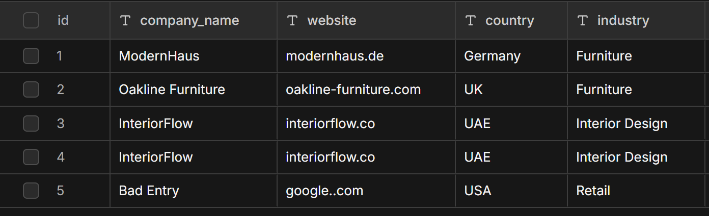

# 🚀 Company Lead Enrichment & Outreach Simulation (n8n)

## 📌 Overview

This project implements a **production-style n8n workflow** that simulates how a company processes, validates, enriches, and prepares outreach messages for potential B2B leads.

The workflow follows all assignment constraints:

* ❌ No website scraping
* ❌ No real email discovery
* ❌ No real email sending
* ❌ No external enrichment APIs
* ✅ Fully simulated outreach
* ✅ Strong validation & error handling
* ✅ Deduplication logic
* ✅ Internal CRM-style storage

Instead of Google Sheets, I used **n8n Data Tables** to simulate a CRM system with structured storage and logging.

---

# 🏗️ Workflow Architecture

## High-Level Flow

1. **Manual Trigger**
2. Read Input Leads (Data Table)
3. Validate & Normalize Company Data
4. Deduplicate (Domain OR Company Name)
5. Simulated Email Hypothesis Generation
6. Simulated Outreach Email Creation
7. Store Results in Output CRM Table
8. Log Errors in Separate Error Table

---

# 📥 Input Schema

Input Data Table: `input_companies`

| Company Name | Website | Country | Industry |
| ------------ | ------- | ------- | -------- |

The workflow handles:

* Missing websites
* Invalid domains
* Duplicate companies
* Inconsistent naming
* Extra whitespace
* Mixed protocol formats (http/https/www)

---

# 🧠 Step 1: Company Data Validation & Normalization

Node: **Validate & Normalize (Code Node)**

### Logic Implemented:

### 1️⃣ Company Name Normalization

* Trim whitespace
* Collapse multiple spaces
* Convert to lowercase for deduplication comparison

### 2️⃣ Website Validation

* Remove protocol (`http://`, `https://`)
* Remove `www.`
* Remove path (`/about`, etc.)
* Enforce strict domain regex validation:

  ```
  /^(?!-)(?!.*\.\.)([a-z0-9-]+\.)+[a-z]{2,}$/
  ```
* Flag invalid domains as:

  ```
  Skipped (Invalid Website)
  ```

### 3️⃣ Unified Internal Schema

Each row is transformed into:

```json
{
  "company": "",
  "domain": "",
  "industry": "",
  "country": "",
  "originalWebsite": "",
  "status": "",
  "timestamp": ""
}
```

---

# 🔁 Deduplication Logic

Duplicates are detected using:

* ✅ Domain
* OR
* ✅ Normalized company name

Implementation:

* In-memory Set during processing
* Secondary check against already generated output entries
* Duplicates are NOT ignored
* They are logged with status:

```
Duplicate
```

---

# 📧 Step 2: Lead Enrichment (Simulation Only)

Node: **Generate Email Hypotheses**

No real emails are discovered.

Instead, probable email formats are generated based on business logic.

## Priority Logic

Based on Industry:

| Industry Type       | Generated Email | Confidence |
| ------------------- | --------------- | ---------- |
| B2B / Manufacturing | sales@domain    | High       |
| Services / Design   | info@domain     | Medium     |
| Tech / SaaS         | contact@domain  | Medium     |
| Retail              | support@domain  | Low        |
| Fallback            | info@domain     | Low        |

Each record includes:

```json
{
  "generatedEmail": "",
  "confidenceLevel": "",
  "emailReason": ""
}
```

These are explicitly marked as assumptions.

---

# ✉️ Step 3: Outreach Email Generation (Simulated)

Node: **Generate Outreach Email Content**

The system dynamically generates:

* Industry-aware subject line
* Personalized body
* Country reference
* Professional B2B tone
* Clear CTA (15-minute call)

Example Subject:

```
Transform Your Furniture Business with Digital Solutions
```

The email body includes:

* Company name
* Industry reference
* Country reference
* Business value propositions
* Simulation disclaimer

🚫 Emails are never sent externally
✅ Stored internally only

---

# 📊 CRM Simulation (Output Storage)

Instead of Google Sheets, I used **n8n Data Tables**.

## Output Table: `output_leads`

| Field             | Description                     |
| ----------------- | ------------------------------- |
| company           | Company Name                    |
| website           | Clean Domain                    |
| industry          | Industry                        |
| country           | Country                         |
| generated_email   | Simulated Email                 |
| confidence_level  | High / Medium / Low             |
| email_subject     | Generated Subject               |
| email_body        | Generated Email Content         |
| processing_status | Generated / Duplicate / Skipped |
| timestamp         | ISO timestamp                   |

---

# ⚠️ Error Handling (Mandatory Requirement)

## Implemented:

### 1️⃣ Switch-based status routing

* Generated
* Duplicate
* Skipped (Invalid Website)

### 2️⃣ Dedicated Error Logging Table

Table: `error_log`

Each log includes:

```json
{
  "workflow": "",
  "node": "",
  "error_message": "",
  "input_data": "",
  "timestamp": ""
}
```

No silent failures.

Invalid domains are:

* Stored in output table
* Logged in error table

---

# 📸 Tables Screenshots

## Input Table



## Output Table


## Error Log Table


---

# 🔧 Architecture Decisions

* Clean node naming
* Modular code nodes
* No hard-coded domains
* Regex-based validation
* Centralized status handling
* Reusable enrichment logic
* Strict simulation compliance

---

# 📦 Deliverables Included

* ✅ Exported n8n Workflow JSON
* ✅ README.md (this file)
* ✅ Sample input dataset
* ✅ Screenshots of 3 Data Tables
* ✅ Error logging implementation

---

# 🧪 Edge Cases Handled

* Empty website field
* Invalid domain format
* Duplicate by domain
* Duplicate by name
* Mixed protocols
* Extra whitespace
* Case sensitivity differences

---

# ⚠️ Known Limitations

* Deduplication inside a single execution uses in-memory Set (not persistent across separate workflow runs unless already stored in output table).
* Industry matching is string-based (could be enhanced with classification logic).
* Confidence scoring is rule-based (not ML-based).
* Currently uses Manual Trigger (can be extended to scheduled trigger).

---

# 🎯 Assignment Compliance

| Requirement        | Status |
| ------------------ | ------ |
| No scraping        | ✅      |
| No real emails     | ✅      |
| No sending emails  | ✅      |
| No paid APIs       | ✅      |
| Deduplication      | ✅      |
| Error Logging      | ✅      |
| CRM Simulation     | ✅      |
| Clean Architecture | ✅      |

---

# 🏁 Conclusion

This workflow demonstrates:

* Production-level automation design
* Defensive data validation
* Deterministic enrichment logic
* Structured CRM simulation
* Clear separation of concerns
* Robust error handling
* Compliance with all constraints

The solution is modular, extensible, and ready to scale into a real enrichment system with minimal architectural changes.

---
